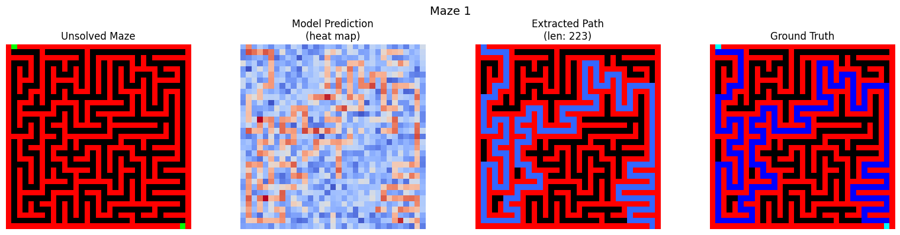

# Diffusion Maze Solver

A deep learning project that solves procedurally generated mazes using a **Conditional Denoising Diffusion Probabilistic Model (DDPM)**.

This project demonstrates a hybrid approach to pathfinding: using a generative diffusion model to "intuit" the solution path and a traditional search algorithm (A*) to refine that intuition into a valid, connected trajectory.



## Table of Contents

- [Overview](#overview)
- [Key Features](#key-features)
- [How It Works](#how-it-works)
    - [The Diffusion Process](#the-diffusion-process)
    - [Hybrid Path Extraction](#hybrid-path-extraction)
- [Technical Architecture](#technical-architecture)
- [Installation & Usage](#installation--usage)
- [Results](#results)

## Overview

Traditional maze algorithms (like BFS or A*) are deterministic and exact. This project explores a probabilistic approach using generative AI. By treating maze solving as an image-to-image translation task, we train a U-Net to "denoise" a random field into a coherent path, conditioned on the maze structure.

The model learns the global structure of valid paths, effectively acting as a learned heuristic that guides a post-processing step to guarantee solution validity.

## Key Features

- **Procedural Maze Generation**: Automated generation of random maze pathfinding datasets.
- **Conditional Diffusion**: Implementation of a DDPM conditioned on maze walls, start, and end points.
- **Robust Pathfinding**: A unique "Hybrid" solver that combines the diffusion model's probability map with A* search to ensure 100% connectivity.
- **PyTorch Implementation**: built from scratch using PyTorch, including custom U-Net and Diffusion schedulers.

## How It Works

### The Diffusion Process

The core idea is to learn the distribution of valid paths $p(path|maze)$.
1.  **Forward Process**: We take a ground-truth solution path and progressively add Gaussian noise until it is indistinguishable from random noise.
2.  **Reverse Process (Training)**: A neural network (U-Net) is trained to predict the noise added at each step, taking the **Maze Layout** (Walls, Start, End) as a condition.
3.  **Inference**: We start with pure noise and iteratively refine it using the trained network, conditioned on a new, unseen maze.

### Hybrid Path Extraction

Generative models can sometimes produce "disconnected" paths or hallucinations. To solve this, we don't use the model's output as the final answer. Instead:
1.  The model outputs a **prediction map** (values closer to 1 indicate high confidence of being on the path).
2.  We treat this prediction map as a **Cost Surface** for a graph search algorithm.
3.  An **A* algorithm** runs on the maze, where moving through "high confidence" regions cost very little, and "low confidence" regions cost a lot.

This ensures the final solution is always a valid, continuous path from Start to End, but the search is massively accelerated/guided by the AI's intuition.

## Technical Architecture

*   **Model**: Custom U-Net with:
    *   Sinusoidal Time Embeddings
    *   Residual connections
    *   Group Normalization and SiLU activations
    *   Conditional input concatenation (4 channels: Walls, Start, End, Noisy Path)
*   **Diffusion**:
    *   1000 timesteps
    *   Cosine annealing learning rate
    *   Linear beta schedule
*   **Input Size**: 33x33 Grids (Scaleable)

## Installation & Usage

### Prerequisites
*   Python 3.8+
*   PyTorch
*   NumPy, Matplotlib, Tqdm

### Running the Project

1.  **Clone the repository**
    ```bash
    git clone https://github.com/yourusername/diffusion-maze-solver.git
    cd diffusion-maze-solver
    ```

2.  **Run the Notebook**
    Open `solver.ipynb` in Jupyter or VS Code to train the model and visualize results.

## Results

After training for ~20-50 epochs, the model effectively learns to ignore dead ends and highlight the correct corridor. The post-processing step successfully extracts the exact coordinate list for the solution.

